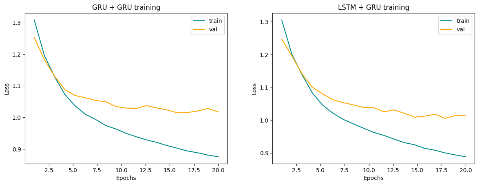
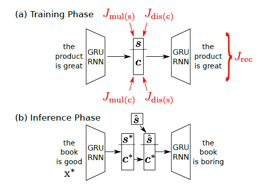
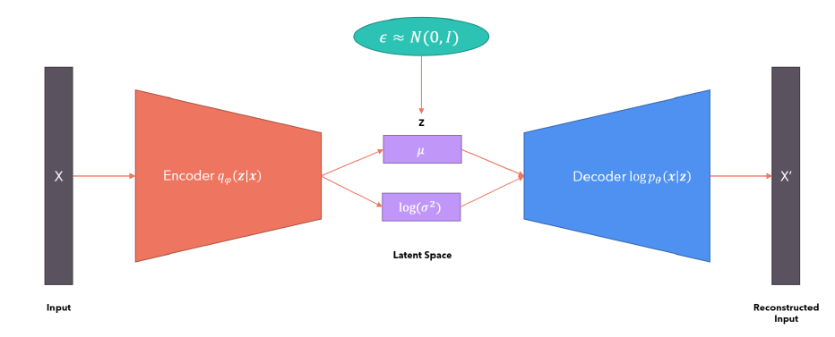
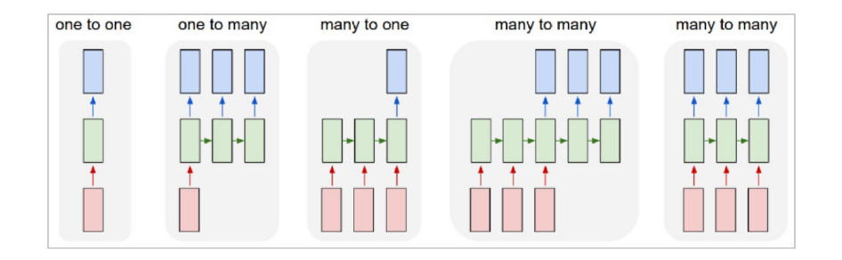
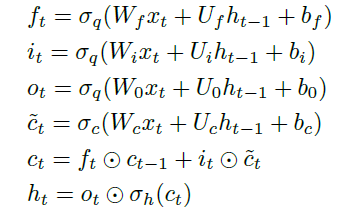
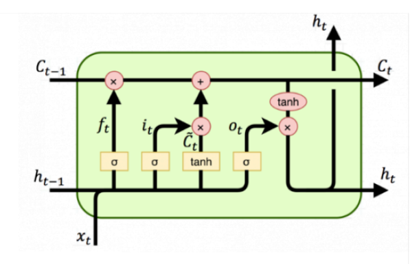
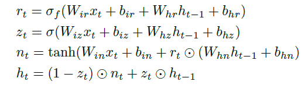
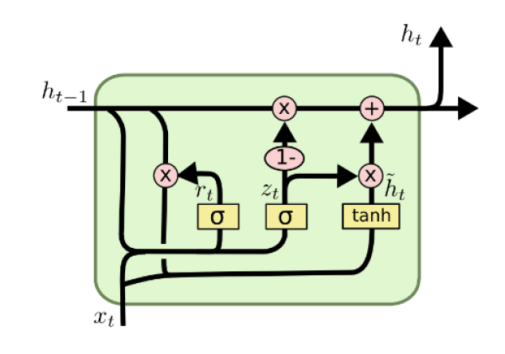

# *Dante <--> Modern Italian* Text Style Transfer with non parallel data 🖋️
Pytorch implementation of text style transfer as described in [J. Vineet et al. 2018](https://arxiv.org/abs/1808.04339).

The goal of this project is achieving neural style transfer between Dante Alighieri sentences and modern italian (and viceversa) training a VAE model on non parallel data to learn the two styles and to perform the style transfer during inference phase. Simplifying the architecture of this project, two other simpler project can be developed: [Text Generation](https://github.com/MassimoMario/Italic_Text_Generation) and [Text Classification](https://github.com/MassimoMario/Italic_Text_Style_Classification).

The Word Embedding layer has been initialized using a Word2vec model trained on these two corpus, one for each language style:
* Dante: _Divina Commedia_
* Italian: _Uno, nessuno e centomila_ by Luigi Pirandello, and _I Malavoglia_ by Giovanni Verga

Example of output for the two models giving as input *"nel mezzo del cammin di nostra vita mi ritrovai per una selva oscura che la diritta via era smarrita"* to transfer in Italian:

* **GRU + GRU**: *e la sua insofferenza e la sua vita come si vede a vedere cos è successo che non è*

* **LSTM + GRU**: *e non si vedeva più la testa e non aveva più coraggio di non far nulla e non si*

## Table of Contens 
* [Structure](#Structure)
* [Requirements](#Requirements)
* [Usage](#Usage)
* [Results](#Results)
* [Theory Background](#Theory-Background)
* [References](#References)

## Structure
* [`TST_GRU.ipynb`](TST_GRU.ipynb) main notebook for Text Style Transfer with a GRU-GRU architecture, both Encoder and Decoder are RNNs with GRU cells
* [`TST_LSTM.ipynb`](TST_LSTM.ipynb) main notebook for Text Style Transfer with a LSTM-GRU architecture where Encoder is a RNN with LSTM cells and the Decoder is a RNN with GRU cells
* [`models.py`](models.py) module containing two classes for VAE model, Style and Content classifier classes, Adversarial Style and Adversarial Content classifier classes, and EarlyStopping class
* [`config_dataset.py`](config_dataset.py) module containing functions for creating datasets
* [`training.py`](training.py) module containing training function and all the loss functions
* [`gruvae_state_dict.pth`](gruvae_state_dict.pth) and [`gru_style_cl_state_dict.pth`](gru_style_cl_state_dict.pth) contain, respectively, the parameters of the pretrained GRU-GRU model and his Style Classifier
* [`lstmvae_state_dict.pth`](lstmvae_state_dict.pth) and [`lstm_style_cl_state_dict.pth`](lstm_style_cl_state_dict.pth) contain, respectively, the parameters of the pretrained LSTM-GRU model and his Style Classifier
* [`divina_commedia.txt`](divina_commedia.txt) Divina Commedia corpus by _Dante Alighieri_
* [`uno_nessuno_e_i_malavoglia.txt`](uno_nessuno_e_i_malavoglia.txt) Italian language corpus, made up of _Uno, nessuno e centomila_ by Luigi Pirandello and _I Malavoglia_ by Giovanni Verga


## Requirements
- Numpy
- Matplotlib
- tqdm
- Pytorch
- Gensim

## Usage 
To get started, first open up a terminal and clone the project repository

```bash
git clone git@github.com:MassimoMario/Dante_to_italian_Text_Style_Transfer.git
```
Then pip install pytorch and gensim

```bash
pip install torch
```
```bash
pip install gensim
```

Then go through [`TST_GRU.ipynb`](TST_GRU.ipynb) or [`TST_LSTM.ipynb`](TST_LSTM.ipynb) and run the cells following the Markdown annotations.

In the notebook a dataset of the two styles is created and it's used to train the VAE model. You can also choose to load pre-trained model and to see inference results. A CNN Text Classifier is also defined and trained independently to quantify the Style Transfer Accuracy.

# Results
Here the results of training of two models: one taking GRUs as both Encoder and Decoder, and one taking a LSTM as Encoder and a GRU as Decoder:



Here are three parameters to evaluate the quality of the Style Transfer:

| Model | STA | PPL | WO |
| --- | --- | --- | --- |
| GRU + GRU | 0.979 | 142 | 0.037 |
| LSTM + GRU | 0.971 | 231 | 0.030 |

Where **STA** is the Style Transfer Accuracy, computed using an independently trained Text Classifier,   $PPL = 2^{- \frac{1}{N} \sum_i log_2 \left( P(w_i)\right)}$ is the Perplexity, and $WO = \frac{count(x \cap y)}{count(x \cup y)}$ is the Word Overlapping between input sequence $x$ and the transferred one $y$.

## Theory background
The AI model consist of a Variational Autoencoder in which both Encoder and Decoder are Recurrent Neural Networks.

The aim of the training phase is to reconstruct the input sentence and learn a disentangled representation of the latent space in order to interpret it as composed of two parts: Style and Content space. During inference a sentence is embedded in this Style-Content latent space and, before feeding the decoder, the Style space is replaced with a different Style tensor and concatenated with the original Content.



_From J. Vineet et al. 2018_

To train a model to learn such a latent space, 4 losses are added to the usual VAE loss: 2 to discriminate style and content from the two spaces and 2 adversarial losses for style and content:

$\mathcal{L}_ {tot} = \mathcal{L}_ {VAE} (\theta_E, \theta_D) + \lambda_ {mul(s)} \cdot \mathcal{L}_ {mul(s)} (\theta_E, \theta_ {mul(s)}) + \lambda_ {mul(c)} \cdot \mathcal{L}_ {mul(c)} (\theta_E, \theta_ {mul(c)}) - \lambda_ {adv(s)} \cdot \mathcal{L}_ {adv(s)}(\theta_E) - \lambda_ {adv(c)} \cdot \mathcal{L}_ {adv(c)}(\theta_E)$

Where $\mathcal{L}_ {VAE}$ is the VAE loss, $\mathcal{L}_ {mul(s)}, \mathcal{L}_ {mul(c)}$ the losses for discriminating style and content from the disentangled latent space, $\mathcal{L}_ {adv(s)}, \mathcal{L}_ {adv(c)}$ the adversarial losses for style and space, and $\lambda_ {mul(s)}, \lambda_ {mul(c)}, \lambda_ {adv(s)}, \lambda_ {adv(c)} \in \mathbb{R}^+$ are hyperparameters.

### VAEs
A simple Autoencoder is an unsupervised Machine Learning tool that encodes each instance of the dataset in an latent space with a dimension much smaller than the dimension of the input data. A decoder then attempts to reconstruct the input data from the information encoded in the latent space.

A Variational Autoencoder adds a structure to the latent space, which is taken as a Gaussian a multivariate distribution as a prior knowledge. The training objective of a VAE is to maximize the ELBO (Evidence LOwer Bound), or, in other words, minimizing this loss function:

$\mathcal{L}_ {VAE} (\theta_E, \theta_D )  = - \mathbb{E}_ {p^E_{\theta}(z|x)} [log p^D_{\theta}(x|z)] + \lambda_{KL}\cdot \mathcal{D}_ {KL} \left( p^E_{\theta}(z|x) || p_{latent}^{prior}(z) \right)$

Where $\mathcal{D}_ {KL}$ is the Kullback–Leibler divergence, $\lambda_{KL} \in \mathbb{R}^+$ is an hyperparameter, and $p_{latent}^{prior}(z) = \mathcal{N}(\vec{0}, \mathbb{I})$

In order to compute meaningful gradients for the backpropagation, after the Encoder pass, the so called *re-parametrization trick* allows to write the latent space variable $z$ as a deterministic and differentiable function of $\theta_E$ and $x$ introducing a Standard Gaussian random varaiable $\epsilon$:

$\epsilon \sim \mathcal{N} (\vec{0}, \mathbb{I})$

$\mu, log \left( \sigma^2 \right) = Encoder(x)$

$z = \mu + \sigma \bigodot \epsilon$

Where $\bigodot$ represent the element-wise product.



*Pictorial rapresentation of a VAE*

### RNNs: GRU & LSTM
Recurrent Neural Networks (RNNs) are a class of artificial neural networks designed to handle sequential data. Unlike traditional feedforward neural networks, RNNs have connections that form directed cycles, allowing information to persist and be carried from one step of the sequence to the next. They are well-suited for tasks where temporal dynamics or sequential patterns are important, such as time series forecasting, natural language processing, and speech recognition.



The input of a RNN is elaborated by the hidden states $h$ in a non-linear way by a matrix $W_{hh}$ and then fed to a linear layer to get an output $y$ through a matrix $W_{hy}$. The hidden layer produces also an hidden vector $v$ which is fed again to the hidden states and determines their evolution. The output at each time step depends not only on the current input but also on the output from the previous time step. This characteristic allows RNNs to capture dependencies and patterns across sequences. The transformation relations can be written as:

$h_t = tanh(W_{hh} h_{t-1} + W_{xh} x_t)$

$o_t = W_{ht}h_t$


To overcome RNNs limitations in processing long term dependencies (vanishing and exploding gradient), more sophisticated of RNNs have been designed: Long Short-Term Memory (LSTM) and Gated Recurrent Unit (GRU).

LSTMs incorporate three types of gates:  the input gate, the forget gate, and the output gate. These gates work together to control the flow of information into the cell state, out of the cell state, and how much of the cell state should be updated. The input gate determines how much of the new information should be added to the cell state, while he forget state decides which information from the previous cell state $C_{t-1}$ should be forgotten, and finally the output gate determines which part of the cell state should be output as the hidden state. This structure allows LSTMs to remember information over longer sequences and selectively retain or discard information as needed. The equations below describe the forward pass in a LSTM cell:



Where $t$ denotes time step. $W_{\alpha}$ and $U_{\alpha}$ matrices contain, respectively, the weights of the input and recurrent connections, $b_{\alpha}$ refers layer biases and $\sigma_{\alpha}$ to gates activation function, where the subscript $\alpha$ can refer to input $i$, forget $f$, output $o$ gate or memory cell $c$. $x_t$ and $h_t$ are input and hidden state at time step $t$.

A sketch of LSTM cell structure:



A simplified alternative to LSTM is the GRU unit. GRUs use just two types of gates: the update gate and the reset gate. The update gate determines how much of the past information needs to be passed to the future, while the reset gate decides how much of the of the previous hidden state should be forgotten. 

The equations for a forward pass in a GRU cell are:



Where $r_t, z_t$ and $n_t$ are respectively the reset, update and new gates. $\sigma$ is the activation function and $\bigodot$ the Hadamard product. $h_t$ is the hidden state at time step $t$.

A sketch of GRU cell structure is shown below:




## References
- J. Vineet et al. 2018 *"Disentangled Representation Learning for Non-Parallel Text Style Transfer"*, [https://arxiv.org/abs/1808.04339](https://arxiv.org/abs/1808.04339)
- [Matteo Falcioni Github repository](https://github.com/MatteoFalcioni/pattern_recognition)

